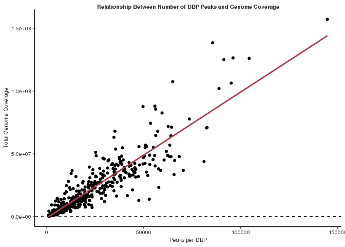

Genomics Final Project
================
Erika Mehrhoff
4/24/2023

## Goal:

Here we aim to download all available DNA binding protein (DBP) profiles
in a single cell state (measured by ChIP-seq). This will allow us to
investigate the binding properties of hundreds of DBPs in the same
cellular context or background. We have curated a set of over 1,000
ChIPseq data sets comprised of 48 DBPs in HEPG2 cells from the ENCODE
consortium. We required duplicate ChIP-seq experiments for a given DBP
and other criterion that can be found here:

<https://www.encodeproject.org/report/?type=Experiment&status=released&assay_slims=DNA+binding&biosample_ontology.term_name=HepG2&assay_title=TF+ChIP-seq&biosample_ontology.classification=cell+line&files.read_length=100&files.read_length=76&files.read_length=75&files.read_length=36&assay_title=Control+ChIP-seq&assay_title=Histone+ChIP-seq&files.run_type=single-ended>

### These samples were selected on the following criteria:

1.  “chromatin” interaction data, then DNA binding data, cell line
    HEPG2, “TF-Chip-seq”.
2.  We further selected “TF Chip-seq”, “Control chip-seq” and “Histone
    Chip-seq”.
3.  We selected several read lengths to get the most DNA binding
    proteins (DBPs)
4.  Read lengths: 100, 76, 75, 36
5.  ONLY SINGLE END READS (this eliminates 54 samples)

### Experimental data was downloading by (ENCODE report.tsv):

<https://www.encodeproject.org/report.tsv?type=Experiment&status=released&assay_slims=DNA+binding&biosample_ontology.term_name=HepG2&assay_title=TF+ChIP-seq&biosample_ontology.classification=cell+line&files.read_length=100&files.read_length=76&files.read_length=75&files.read_length=36&assay_title=Control+ChIP-seq&assay_title=Histone+ChIP-seq&files.run_type=single-ended>

### The FASTQ files were downloaded with:

“<https://www.encodeproject.org/metadata/?status=released&assay_slims=DNA+binding&biosample_ontology.term_name=HepG2&assay_title=TF+ChIP-seq&biosample_ontology.classification=cell+line&files.read_length=100&files.read_length=76&files.read_length=75&files.read_length=36&assay_title=Control+ChIP-seq&assay_title=Histone+ChIP-seq&files.run_type=single-ended&type=Experiment>”

MD5sums were checked with all passing (see encode\_file\_info function
to reterive MD5Sum values that are not available from the encode portal
(/util)

### Processing data:

We processed all the read alignments and peak calling using the NF\_CORE
ChIP-seq pipeline: (nfcore/chipseq v1.2.2)

### All subequent analyses are contained within this document.

You will find all the .broadPeak peak files here:
/scratch/Shares/rinnclass/CLASS\_2023/data/data/peaks

## First I want to analyze the large data for general properties

### Import broad peak files and find consensus peaks between replicates

``` r
# filepath to import peaks
#basepath <- "/scratch/Shares/rinnclass/CLASS_2023/erme3555"
#peak_path <- "CLASS_2023/CLASSES/05_R_analyses/analysis/00_consensus_peaks"
#broadpeakfilepath <- "/scratch/Shares/rinnclass/CLASS_2023/data/data/peaks"

# using import peaks to import .broadPeak files (~10min)
#peak_list <- import_peaks(consensus_file_path = broadpeakfilepath)

# Creating unique DBP object for create_consensus_peaks_from_reduced
#dbp <- unique(sapply(names(peak_list), function(x) {
   #unlist(strsplit(x, "_"))[1]
#})) # remove replicate number

# now run our function consensus_from_reduced
#consensus_list <- lapply(dbp, consensus_from_reduced, peak_list)

# adding names to the GRange list
#names(consensus_list) <- dbp

# creating list of num_peaks per dbp
#num_peaks <- sapply(consensus_list, length) # vector of number of peaks for each protein

# Filter out any chip data less 1,000 peaks == filtered consensus peaks
#filtered_consensus_list <- consensus_list[sapply(consensus_list, length) > 1000]

# saving 
#save(filtered_consensus_list, file = "results/filtered_consensus_list.RData")

# keeping track of DBPs lost
#lost_dbps <- names(consensus_list[sapply(consensus_list, length) < 1000]) %>% as.data.frame()

# saving 
#write.table(lost_dbps, "results/lost_dbps.csv")

# exporting filtered_consensus_peaks
#for(i in 1:length(filtered_consensus_list)) {
  #rtracklayer::export(filtered_consensus_list[[i]], 
                      #paste0("results/filtered_consensus_peaks/", 
                            # names(filtered_consensus_list)[i], 
                             #"_filtered_consensus_peaks.bed"))
#}
```

### Results:

Our strategy was to take peaks in each replicate and find all
overlapping peak windows. We then took the union length of the
overlapping range in each peak window. We further required that a DBP
has at least 1,000 peaks (the min quartile of peaks observed). We
started with chip data on 486 DNA binding proteins and ended up with 430
DBPs that have at least 1,000 peaks in both replicates.

### Prep Genome features

``` r
# loading in genome features
#gencode_gr <- rtracklayer::import("/scratch/Shares/rinnclass/CLASS_2023/data/data/genomes/gencode.v32.annotation.gtf")

# gencode genes
#gencode_genes <- gencode_gr[gencode_gr$type == "gene"] 

# mrna_genes
#mrna_genes <- gencode_genes[gencode_genes$gene_type %in% "protein_coding"]

# lncrna_genes
#lncrna_genes <- gencode_genes[gencode_genes$gene_type %in% "lncRNA"] 

# mrna_lncrna_genes
#mrna_lncrna_genes <- gencode_genes[gencode_genes$gene_type %in% c("protein_coding","lncRNA")]

# lncrna_mrna_promoters
#lncrna_mrna_promoters <- promoters(mrna_lncrna_genes, upstream = 1000, downstream = 1000)

# lncrna_gene_ids
#lncrna_gene_ids <- mrna_lncrna_genes$gene_id[mrna_lncrna_genes$gene_type == "lncRNA"]

# mrna_gene_ids
#mrna_gene_ids <-mrna_lncrna_genes$gene_id[mrna_lncrna_genes$gene_type == "protein_coding"]
```

### Comparing number of peaks to genome coverage

``` r
# create dataframe of the dbp names and the number of consensus peaks
#num_peaks_df <- data.frame("dbp" = names(filtered_consensus_list),
                          # "num_peaks" = sapply(filtered_consensus_list, length))

# add column for total genome covered by peaks
#num_peaks_df$total_peak_length <- sapply(filtered_consensus_list, function(x) sum(width(x)))

# How does peak number and genome coverage compare
ggplot(num_peaks_df,
       aes(x = num_peaks, y = total_peak_length)) +
  xlab("Peaks per DBP") +
  ylab("Total Genome Coverage") +
  ggtitle("Relationship Between Number of DBP Peaks and Genome Coverage")+
  geom_point() +
  geom_abline(slope = 1, linetype="dashed") +
  geom_smooth(method = "lm", se=FALSE, formula = 'y ~ x',
              color = "#a8404c")
```

<!-- -->

``` r
#ggsave("figures/genome_coverage.pdf", height = 50, width = 12, limitsize = F)
```

### Results:

There is a positive linear relationship between the number of peaks for
a DBP and the total genome coverage of those peaks.

### Distribution of promoter overlaps versus gene-bodies

``` r
# creating number of promoter overlaps entry
#promoter_peak_counts <- count_peaks_per_feature(lncrna_mrna_promoters, filtered_consensus_list, type = "counts")

# summing rows to get total number of promoter overlaps
#num_peaks_df$peaks_overlapping_promoters <- rowSums(promoter_peak_counts)

# creating number of gene body overlaps entry
#genebody_peak_counts <- count_peaks_per_feature(mrna_lncrna_genes, 
                                                #filtered_consensus_list, 
                                                #type = "counts")

# summing rows to get total number of gene body overlaps
#num_peaks_df$peaks_overlapping_genebody <- rowSums(genebody_peak_counts)

# visualize distribution to compare
hist(num_peaks_df$peaks_overlapping_promoters)
```

<!-- -->

``` r
hist(num_peaks_df$peaks_overlapping_genebody)
```

<!-- -->

### Results:

The distribution of peaks overlapping promoters is different than peaks
overlapping gene-bodies. The distribution of peaks overlapping promoters
is bimodal with the most frequent number of promoter overlaps per DBP
around 15,000. The distribution of peaks overlapping gene-bodies is
right skewed, with most of the gene body overlaps per DBPs being less
than 40,000.

### Super Binders

``` r
# Make a list of genes that are "super binders" 
#running count_peaks_per_feature
#promoter_peak_occurence <- count_peaks_per_feature(lncrna_mrna_promoters, filtered_consensus_list, 
                                               #type = "occurrence")

# Let's double check that all lncrna & mrna genes are accounted for:
stopifnot(all(colnames(promoter_peak_occurence) == lncrna_mrna_promoters$gene_id))

# Now let's use the 'data.frame()' fucntion. Set up a bunch of colnames and populate them.
#peak_occurence_df <- data.frame("gene_id" = colnames(promoter_peak_occurence),
                               # "gene_name" = lncrna_mrna_promoters$gene_name,
                                #"gene_type" = lncrna_mrna_promoters$gene_type,
                               # "chr" = lncrna_mrna_promoters@seqnames,   
                               # "1kb_up_tss_start" = lncrna_mrna_promoters@ranges@start,
                               # "strand" = lncrna_mrna_promoters@strand,
                                #"number_of_dbp" = colSums(promoter_peak_occurence))

# Look at the distribution of binding and pick cut off for super binders
ggplot(peak_occurence_df, aes(x = number_of_dbp)) +
geom_density(alpha = 0.2, color = "#424242", fill = "#424242") +
  theme_paperwhite() +
  xlab(expression("Number of DBPs")) +
  ylab(expression("Density")) +
  ggtitle("Promoter binding events",
          subtitle = "mRNA and lncRNA genes") 
```

<!-- -->

``` r
#ggsave("figures/Distribution_of_binding.pdf", height = 50, width = 12, limitsize = F)

# add column for super binder or not
#peak_occurence_df <- peak_occurence_df %>%
  #mutate(superbinders = peak_occurence_df$number_of_dbp > 200)
#peak_occurence_df <- peak_occurence_df %>%
 # mutate(superbinder2 = ifelse(peak_occurence_df$superbinders ==T, "Superbinder", "notsuperbinder"))

# number of super binding genes
#nrow(peak_occurence_df) # 36814
#super_binders <- filter(peak_occurence_df, superbinder2=="Superbinder")
#nrow(super_binders) # 11689
#reg_binders <- filter(peak_occurence_df, superbinder2=="notsuperbinder")
#nrow(reg_binders) # 25125

# Is there a difference in mRNA and lncRNA promoter overlaps?
rb_lnc <- nrow(reg_binders[reg_binders$gene_type=="lncRNA",])
rb_mr <- nrow(reg_binders[reg_binders$gene_type=="protein_coding",])
sb_lnc <- nrow(super_binders[super_binders$gene_type=="lncRNA",])
sb_mr <- nrow(super_binders[super_binders$gene_type=="protein_coding",])

rnames <- c("mRNA","lncRNA")
cnames <- c("Regular","Super Binder")
matrix(data= c(rb_mr, rb_lnc,sb_mr , sb_lnc ), ncol=2, dimnames=list(rnames,cnames))
```

    ##        Regular Super Binder
    ## mRNA     10788         9177
    ## lncRNA   14337         2512

### Results:

After looking at the distribution of the number of DBPs bound to a gene
it was determined that any genes that have more that 200 DBPs bound are
“super-binders.” Out of 36,814 genes, 11,689 were found to be
super-binders. Super-binding promoters are more associated with mRNA
than lncRNA, which is the opposite in the normal binders. There were
9,177 mRNA superbinders and 2,512 lncRNA superbinders.

### Transcription Factors

``` r
# How many of these proteins are TFs? What is the most represented type of DBD?
# reading in TF annotations 
#human_tfs <- readxl::read_excel("../../analysis/01_create_consensus_peaks/results/TF_annotations.xlsx",
                                #sheet = 2, skip = 1)

# let's rename the 4th column to indicate if it is a TF.
#names(human_tfs)[4] <- "is_tf"

# now let's intersect gene names that are in our ChIP data and has TF identity.
#length(which(tolower(num_peaks_df$dbp) %in% tolower(human_tfs$Name)))
# 407 of the 430 have matching gene_names - not bad

#human_tfs <- human_tfs[tolower(human_tfs$Name) %in% tolower(num_peaks_df$dbp), 1:4]
# adding new column names
#names(human_tfs) <- c("ensembl_id",
                      #"dbp",
                      #"dbd",
                      #"tf")

# merging into num_peaks_df
#num_peaks_df <- merge(num_peaks_df, human_tfs, all.x = T)

# count up which dbp are TFs
#nrow(num_peaks_df[num_peaks_df$tf=="Yes",])
#nrow(num_peaks_df[num_peaks_df$tf=="No",])

# most represented type of DBD
#num_peaks_df$dbd <- as.factor(num_peaks_df$dbd)
#names(which.max(table(num_peaks_df$dbd)))
```

### Results:

367 of the DBPs are transcription factors (85%), and the other 86 are
not. The most represented type of DBD is C2H2 ZF.

### Clustering- similarity between genes

``` r
# start with clustering all DBPs and promoters
bin_hier <- hclust(dist(promoter_peak_occurence, method = "binary"))
ggdendro::ggdendrogram(bin_hier, rotate = T,  size = 3)
```

<!-- -->

``` r
#ggsave("figures/ggdendro_plot_promoters.pdf", height = 50, width = 12, limitsize = F)

# if we cluster by lncRNA and mRNA separately what are some similarities and differences?
#lncrna_promoters <- lncrna_mrna_promoters[lncrna_mrna_promoters$gene_type == "lncRNA"]
#mrna_promoters <- lncrna_mrna_promoters[lncrna_mrna_promoters$gene_type == "protein_coding"]

#lncrna_peak_occurence <- promoter_peak_occurence[,lncrna_promoters$gene_id]
#mrna_peak_occurence <- promoter_peak_occurence[,mrna_promoters$gene_id]

# we do the clutering the same as above or we can combine the dist and hclust:
bin_hier_mrna <- hclust(dist(mrna_peak_occurence, method = "binary"))
bin_hier_lncrna <- hclust(dist(lncrna_peak_occurence, method = "binary"))

# Now plot with ggdendro
ggdendro::ggdendrogram(bin_hier_mrna, rotate = T,  size = 3)
```

<!-- -->

``` r
#ggsave("figures/ggdendro_plot_mrna.pdf", height = 50, width = 12, limitsize = F)

ggdendro::ggdendrogram(bin_hier_lncrna, rotate = T,  size = 3)
```

<!-- -->

``` r
#ggsave("figures/ggdendro_plot_lncrna.pdf", height = 50, width = 12, limitsize = F)
```

### Result:

When clustering all the DBPs binding to promoters there are many
clusters of realted DBPs. An example is 2 related DBPs in the
dendrogram, ZNF639 and CBFB. ZNF639 is zinc finer and CBFB is a gene for
core-binding factor subunit beta. CBFB binds to one of three related
RUNX proteins to form different versions of CBF. These protein complexes
bind to specific regions of DNA and help activate certain genes. I
hypothesize that ZNF639 is involved in this trancriptonal activation. We
also clustered lncRNA and mRNA promoters separately and can see similar
clusterting patterns as the overall clustering.

### Metaplots- mRNA versus lncRNA

``` r
# Let's look at the metaplot for all DBPs on lncRNA and mRNA promoters seperately (hint facet wrap).
#lncrna_metaplot_df <- data.frame(x = integer(), dens = numeric(), dbp = character())

#for(i in 1:length(filtered_consensus_list)) {
  #print(names(filtered_consensus_list)[[i]])
  #tmp_df <- profile_tss(filtered_consensus_list[[i]], lncrna_mrna_promoters = lncrna_promoters)
 # tmp_df$dbp <- names(filtered_consensus_list)[[i]]
  #lncrna_metaplot_df <- bind_rows(lncrna_metaplot_df, tmp_df)
  
#}

#mrna_metaplot_df <- data.frame(x = integer(), dens = numeric(), dbp = character())

#for(i in 1:length(filtered_consensus_list)) {
 #print(names(filtered_consensus_list)[[i]])
  #tmp_df <- profile_tss(filtered_consensus_list[[i]], lncrna_mrna_promoters = mrna_promoters)
  #tmp_df$dbp <- names(filtered_consensus_list)[[i]]
  #mrna_metaplot_df <- bind_rows(mrna_metaplot_df, tmp_df)
  
#}

#mrna_metaplot_df$gene_type <- "mRNA"
#lncrna_metaplot_df$gene_type <- "lncRNA"

#combined_metaplot_profile <- bind_rows(mrna_metaplot_df, lncrna_metaplot_df)
#combined_metaplot_profile$gene_type <- as.factor(combined_metaplot_profile$gene_type)
#combined_metaplot_profile$dbp <- as.factor(combined_metaplot_profile$dbp)

ggplot(combined_metaplot_profile, 
       aes(x = x, y = dens, color = gene_type )) +
 geom_vline(xintercept = 0, lty = 2) + 
  geom_line(linewidth = 1.5) + 
 facet_wrap(dbp ~ ., scales = "free_y") + # y axis diff for each dbp
 ggtitle("Combined Promoter Metaplot") + 
  scale_x_continuous(breaks = c(-1000, 0, 1000),
                     labels = c("-1kb", "TSS", "+1kb"),
                    name = "") +
  ylab("Peak frequency") +
  scale_color_manual(values = c("#424242","#a8404c"))
```

<!-- -->

``` r
#ggsave("figures/promoter_metaplot.pdf")
```

### Results:

The binding of DBPs on mRNA and lncRNA promoters is very similar. There
are some DBPs that have different binding based on the type of promoter.

### Metaplots- Super-binders versus Regular promoters

``` r
# Make a metaplot of DBPS only on Super-binders versus regular promoters 
# superbinder promoters
#super_proms <- subset(peak_occurence_df, superbinder2 == "Superbinder")
#super_proms <- dplyr::select(super_proms, "gene_id")

# non super binder proms
#non_super_proms <- subset(peak_occurence_df, superbinder2 == "notsuperbinder")
#non_super_proms  <- dplyr::select(non_super_proms, "gene_id")

# subet mRNA and lncRNA promoters by super binders
#super_gr <- lncrna_mrna_promoters[lncrna_mrna_promoters$gene_id %in% super_proms$gene_id]
#non_super_gr <- lncrna_mrna_promoters[lncrna_mrna_promoters$gene_id %in% non_super_proms$gene_id]

# setting up superbinders metaplot_Df
#superbinder_metaplot_df <- data.frame(x = integer(), dens = numeric(), dbp = character())

# for loop to populate super binder _metaplot
#for(i in 1:length(filtered_consensus_list)) {
 #print(names(filtered_consensus_list)[[i]])
  #tmp_df <- profile_tss(filtered_consensus_list[[i]], lncrna_mrna_promoters = super_gr)
  #tmp_df$dbp <- names(filtered_consensus_list)[[i]]
  #superbinder_metaplot_df <- bind_rows(superbinder_metaplot_df, tmp_df)
  
#}

# non super binder meta_df
#non_superbinder_metaplot_df <- data.frame(x = integer(), dens = numeric(), dbp = character())

# for loop to populate mRNA_metaplot
#for(i in 1:length(filtered_consensus_list)) {
 #print(names(filtered_consensus_list)[[i]])
  #tmp_df <- profile_tss(filtered_consensus_list[[i]], lncrna_mrna_promoters = non_super_gr)
  #tmp_df$dbp <- names(filtered_consensus_list)[[i]]
  #non_superbinder_metaplot_df <- bind_rows(non_superbinder_metaplot_df, tmp_df)
#}

# now adding the information of gene type
#non_superbinder_metaplot_df$gene_type <- "non_super_binder"
#superbinder_metaplot_df$gene_type <- "superbinder"
#combined_super_binder_metaplot_profile <- bind_rows(non_superbinder_metaplot_df, superbinder_metaplot_df)

ggplot(combined_super_binder_metaplot_profile, 
       aes(x = x, y = dens, color = gene_type )) +
  geom_vline(xintercept = 0, lty = 2) + 
  geom_line(size = 1.5) + 
  facet_wrap(dbp ~ ., scales = "free_y") +
  ggtitle("Promoter Metaplot") + 
  scale_x_continuous(breaks = c(-1000, 0, 1000),
                     labels = c("-1kb", "TSS", "+1kb"),
                     name = "") + 
  ylab("Peak frequency") +
 scale_color_manual(values = c("#424242","#a8404c"))
```

<!-- -->

``` r
#ggsave("figures/superbind_promoter_metaplot.pdf")
```

### Results:

The binding of DBPs on super-binder and regular promoters is very
similar. The super-binders appear to bind more broadly across promoters.

## RNAseq expression

### DBPs bound and RNA output

``` r
# What is the relationship between number of DBPS bound on a promoter versus RNA output (hint TPM)

# reading in salmon tpm
#salmon_tpm <- read.csv("/scratch/Shares/rinnclass/CLASS_2023/data/data/rnaseq/results/salmon/salmon_merged_gene_tpm.csv")

# change salmon tpm dataframe to prepare for analysis 
#tpm <- salmon_tpm %>% 
  #pivot_longer(cols = 2:ncol(.), names_to = "sample_id", values_to = "tpm") %>%
  #merge(samplesheet) %>%
  #group_by(gene_id, condition) %>%
  #summarize(tpm = mean(tpm, na.rm = T)) %>%
  #pivot_wider(names_from = condition, values_from = tpm, names_prefix = "tpm_")


#promoter_features_df <- merge(peak_occurence_df, tpm) 

ggplot(promoter_features_df, 
            aes(y = log2(tpm_homo_sapiens + 0.001), x = number_of_dbp, color = gene_type)) + 
geom_point(data = promoter_features_df %>% filter(tpm_homo_sapiens > 0.001),
             shape = 17, alpha = 0.7) +
  
  # Adding a generative additive model 
  geom_smooth(method = 'gam', formula = y ~ s(x, bs = "cs")) +
  # this adds the statistics from the gam to the figure
  #stat_cor() +
  geom_smooth(method = "lm") +
  # this is just to make it look nice.
  scale_x_continuous(expand = c(0,0)) +
  # adding colors manually
  scale_color_manual(values = c("#a8404c", "#424242"), name = "Gene type") + 
  # title
  ggtitle("Expression vs. promoter binding events") + 
  # labeling axes
  xlab(expression('Number of DBPs')) +
  ylab(expression(log[2](TPM)))
```

<!-- -->

``` r
#ggsave("figures/expression_binding.pdf", height = 50, width = 12, limitsize = F)
```

### Result:

There is a positive linear relationship between number of DBPs bound and
expression levels. The protein coding genes appear to have higher
expression than lncRNAs.

### Super-binders and expression levels

``` r
# If we zoom in on high binding promoters (> 200 DBPs) are there any that don't have any expression?
#super_tpm <- merge(super_proms, tpm) # change df?
#super_tpm2 <- merge(peak_occurence_df, super_tpm)
#sup_no_ex <- filter(super_tpm2, tpm_homo_sapiens<.1)
#nrow(super_tpm2) # 11689 total super-binders
#nrow(sup_no_ex) # 657 superbinders with no expression 

#write_csv(sup_no_ex, "results/superbinder_noexp.csv")

# Are they lncRNA or mRNA
#sup_no_mrna <-filter(sup_no_ex, gene_type=="protein_coding")
#nrow(sup_no_mrna)

#sup_no_lnc <- filter(sup_no_ex, gene_type=="lncRNA")
#nrow(sup_no_lnc)

# clustering super binders with no expression 
#sup_no_peak_occurence <- promoter_peak_occurence[,sup_no_ex$gene_id]
bin_hier_sup <- hclust(dist(sup_no_peak_occurence, method = "binary"))
ggdendro::ggdendrogram(bin_hier_sup, rotate = T,  size = 3)
```

<!-- -->

``` r
#ggsave("figures/ggdendro_plot_super_noexpress.pdf", height = 50, width = 12, limitsize = F)
```

### Results:

Out of the 11689 super-binders, 657 of them have less that .1 tpm. Of
these 657 super-binders with no expression, 260 bind mRNA promoters and
397 bind lncRNA promoters. These are saved in superbinder\_noexp.csv. It
appears there are 2 main clusters of super binders with no expression.

### Save Important Data

``` r
#save(combined_metaplot_profile, combined_super_binder_metaplot_profile, consensus_list, dbp,filtered_consensus_list, gencode_genes,gencode_gr, genebody_peak_counts, human_tfs, lncrna_gene_ids, mrna_gene_ids, lncrna_genes,lncrna_metaplot_df, lncrna_mrna_promoters, lncrna_peak_occurence, lncrna_promoters, lost_dbps,metaplot_df,metaplot_filtered_matrix,metaplot_hclust, mm_scaled,mrna_genes, mrna_lncrna_genes,mrna_metaplot_df,mrna_peak_occurence,mrna_promoters,num_peaks,num_peaks_df,peak_list,peak_occurence_df,promoter_features_df,promoter_peak_counts,promoter_peak_occurence,reg_binders,salmon_tpm,sup_no_ex, sup_no_lnc, sup_no_mrna, sup_no_peak_occurence,super_binders,super_peak_occurence, super_proms, super_tpm, super_tpm2,tmp_df,tpm,file = "results/needed_data.RData")
```
